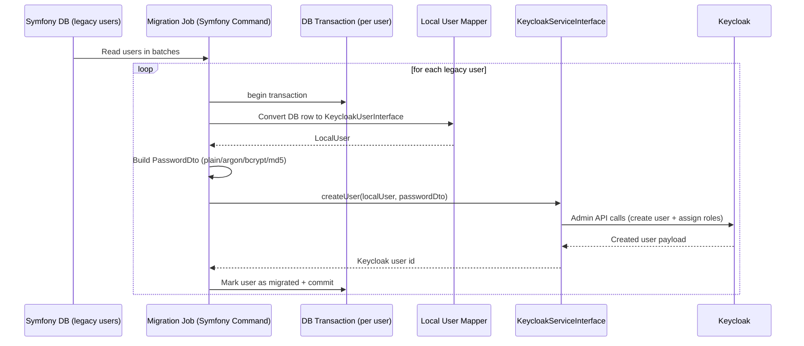

# Use Case 1: Migrating Existing Symfony Users to Keycloak

## When this is useful

Use this pattern when you already have a production Symfony application with local users and you want to move authentication to Keycloak without forcing users to immediately reset passwords.

Typical migration modes:

- plain password re-hash on first login (if you can access plain password during migration window)
- hash-preserving migration for legacy hashes (`argon`, `bcrypt`, `md5`) through `PasswordDto`

## Sequence diagram



## Recommended implementation steps

1. Create a migration command that reads users in deterministic batches (`id > :lastId`, fixed batch size).
2. Process each user in an isolated transaction (transaction per user) to avoid rolling back the whole batch.
3. Map each local user to a class implementing `KeycloakUserInterface`.
4. Build `PasswordDto` based on available password data (`plain`, `argon`, `bcrypt`, `md5`).
5. Call `KeycloakServiceInterface::createUser()`.
6. Persist migration status (`migrated_at`, `keycloak_user_id`, `migration_error`) in your local DB.
7. Make command idempotent: skip rows already marked as migrated.
8. Run in dry-run mode first, then run in production windows.

## Example: migration command service

```php
<?php

declare(strict_types=1);

namespace App\Migration;

use Apacheborys\KeycloakPhpClient\DTO\PasswordDto;
use Apacheborys\KeycloakPhpClient\Service\KeycloakServiceInterface;
use Apacheborys\KeycloakPhpClient\ValueObject\HashAlgorithm;
use App\Keycloak\LocalUser;
use App\Repository\LegacyUserRepository;
use Doctrine\ORM\EntityManagerInterface;
use Psr\Log\LoggerInterface;
use Throwable;

final readonly class LegacyUsersToKeycloakMigrator
{
    public function __construct(
        private LegacyUserRepository $legacyUserRepository,
        private KeycloakServiceInterface $keycloakService,
        private EntityManagerInterface $entityManager,
        private LoggerInterface $logger,
    ) {
    }

    public function migrateBatch(int $limit = 100): int
    {
        $processed = 0;

        foreach ($this->legacyUserRepository->findNotMigrated($limit) as $legacyUser) {
            try {
                $migrated = $this->entityManager->wrapInTransaction(function () use ($legacyUser): bool {
                    $localUser = new LocalUser(
                        username: $legacyUser->getUsername(),
                        email: $legacyUser->getEmail(),
                        firstName: $legacyUser->getFirstName(),
                        lastName: $legacyUser->getLastName(),
                        enabled: $legacyUser->isEnabled(),
                        emailVerified: $legacyUser->isEmailVerified(),
                        roles: $legacyUser->getRoles(),
                    );

                    $passwordDto = $this->buildPasswordDto($legacyUser);
                    $created = $this->keycloakService->createUser($localUser, $passwordDto);

                    $legacyUser->markMigrated($created->getKeycloakId());
                    $this->legacyUserRepository->save($legacyUser, true);

                    return true;
                });

                if ($migrated) {
                    $processed++;
                }
            } catch (Throwable $exception) {
                $legacyUser->markMigrationFailed($exception->getMessage());
                $this->legacyUserRepository->save($legacyUser, true);

                $this->logger->warning('Legacy user migration failed.', [
                    'legacy_user_id' => $legacyUser->getId(),
                    'username' => $legacyUser->getUsername(),
                    'error' => $exception->getMessage(),
                ]);
            }
        }

        return $processed;
    }

    private function buildPasswordDto(object $legacyUser): PasswordDto
    {
        if ($legacyUser->usesMd5()) {
            return new PasswordDto(
                hashedPassword: $legacyUser->getPasswordHash(),
                hashAlgorithm: HashAlgorithm::MD5,
            );
        }

        if ($legacyUser->usesBcrypt()) {
            return new PasswordDto(
                hashedPassword: $legacyUser->getPasswordHash(),
                hashAlgorithm: HashAlgorithm::BCRYPT,
                hashIterations: 13,
                hashSalt: '',
            );
        }

        if ($legacyUser->usesArgon()) {
            return new PasswordDto(
                hashedPassword: $legacyUser->getPasswordHash(),
                hashAlgorithm: HashAlgorithm::ARGON,
                hashIterations: $legacyUser->getArgonTimeCost() ?? 4,
                hashSalt: $legacyUser->getArgonSalt() ?? '',
            );
        }

        return new PasswordDto(plainPassword: $legacyUser->getPlainPasswordForMigrationWindow());
    }
}
```

## Practical notes

- In current bundle/client versions, `LocalUser::getId()` is your stable local identifier, while `getKeycloakId()` is the external Keycloak UUID returned after provisioning.
- If you migrate `md5`, treat it as transitional and plan forced password rotation.
- For large datasets, keep transaction scope per user (or per very small chunk) and avoid one transaction for the whole batch.
- Keep migration logs and error reasons per user.
- Start from a subset of users first (internal accounts, QA cohort).
- Store a migration checkpoint (for example, last processed id) so restarts are predictable.
- Add retry policy with backoff for temporary Keycloak/network errors.
- In this demo environment, you can validate hash behavior with:

```bash
docker compose exec symfony php bin/console keycloak:create-user-with-hashed-password \
  username email@example.com StrongPass123 md5
```

```bash
docker compose exec symfony php bin/console keycloak:create-user-with-hashed-password \
  username email@example.com StrongPass123 argon
```

## Best-practice additions for this project

- Prefer `KeycloakServiceInterface` as the only integration boundary from Symfony app code.
- Keep migration idempotent by storing external Keycloak id and migration status in local DB.
- Separate functional verification from production migration: run flow commands in staging before running migration on real users.
- Keep cleanup and rollback strategy explicit for partial failures.

## Potential future improvements (libraries / extension)

- Add first-class migration helper API in `keycloak-php-client`:
  - batch-oriented migrator interface
  - standardized migration result object (created/skipped/failed + reason)
- Add optional resilience layer:
  - configurable retry/backoff policy for 429/5xx/network errors
  - circuit-breaker hooks for bulk migrations
- Add password migration diagnostics:
  - validator utility for `PasswordDto` against algorithm-specific requirements
  - explicit preflight checks for extension/provider availability in Keycloak
- Add structured observability:
  - correlation id propagation between Symfony logs and Keycloak requests
  - optional metrics hooks (success/failure/latency by operation)
- Add migration safety mode:
  - dry-run diff report (what would be created/updated)
  - built-in checkpoint and resume support
- Add extension-level UX improvements for hash migration:
  - clearer error messages for invalid hash payload/parameters
  - optional compatibility matrix endpoint (supported algorithms and required fields)
