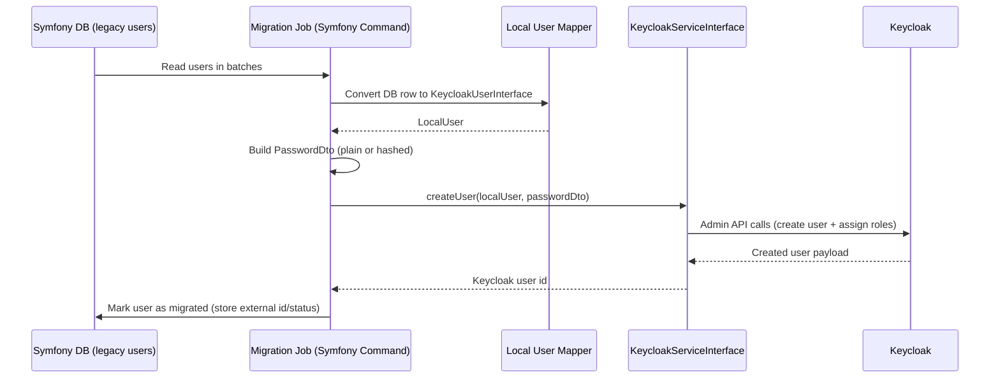

# Use Case 1: Migrating Existing Symfony Users to Keycloak

## When this is useful

Use this pattern when you already have a production Symfony application with local users and you want to move authentication to Keycloak without forcing users to immediately reset passwords.

Typical migration modes:

- plain password re-hash on first login (if you can access plain password during migration window)
- hash-preserving migration for legacy hashes (`argon`, `bcrypt`, `md5`) through `PasswordDto`

## Sequence diagram



## Recommended implementation steps

1. Create a migration command that reads users in deterministic batches (`id > :lastId`, fixed batch size).
2. Map each local user to a class implementing `KeycloakUserInterface`.
3. Build `PasswordDto` based on available password data.
4. Call `KeycloakServiceInterface::createUser()`.
5. Persist migration status (`migrated_at`, `keycloak_user_id`, `migration_error`) in your local DB.
6. Make command idempotent: skip rows already marked as migrated.
7. Run in dry-run mode first, then run in production windows.

## Example: migration command service

```php
<?php

declare(strict_types=1);

namespace App\Migration;

use Apacheborys\KeycloakPhpClient\DTO\PasswordDto;
use Apacheborys\KeycloakPhpClient\Service\KeycloakServiceInterface;
use Apacheborys\KeycloakPhpClient\ValueObject\HashAlgorithm;
use App\Keycloak\LocalUser;
use App\Repository\LegacyUserRepository;

final readonly class LegacyUsersToKeycloakMigrator
{
    public function __construct(
        private LegacyUserRepository $legacyUserRepository,
        private KeycloakServiceInterface $keycloakService,
    ) {
    }

    public function migrateBatch(int $limit = 100): int
    {
        $processed = 0;

        foreach ($this->legacyUserRepository->findNotMigrated($limit) as $legacyUser) {
            $localUser = new LocalUser(
                username: $legacyUser->getUsername(),
                email: $legacyUser->getEmail(),
                firstName: $legacyUser->getFirstName(),
                lastName: $legacyUser->getLastName(),
                enabled: $legacyUser->isEnabled(),
                emailVerified: $legacyUser->isEmailVerified(),
                roles: $legacyUser->getRoles(),
            );

            $passwordDto = $this->buildPasswordDto($legacyUser);
            $created = $this->keycloakService->createUser($localUser, $passwordDto);

            $legacyUser->markMigrated($created->getId());
            $processed++;
        }

        $this->legacyUserRepository->flush();

        return $processed;
    }

    private function buildPasswordDto(object $legacyUser): PasswordDto
    {
        if ($legacyUser->usesMd5()) {
            return new PasswordDto(
                hashedPassword: $legacyUser->getPasswordHash(),
                hashAlgorithm: HashAlgorithm::MD5,
            );
        }

        if ($legacyUser->usesBcrypt()) {
            return new PasswordDto(
                hashedPassword: $legacyUser->getPasswordHash(),
                hashAlgorithm: HashAlgorithm::BCRYPT,
                hashIterations: 13,
                hashSalt: '',
            );
        }

        return new PasswordDto(plainPassword: $legacyUser->getPlainPasswordForMigrationWindow());
    }
}
```

## Practical notes

- If you migrate `md5`, treat it as transitional and plan forced password rotation.
- Keep migration logs and error reasons per user.
- Start from a subset of users first (internal accounts, QA cohort).
- In this demo environment, you can validate hash behavior with:

```bash
docker compose exec symfony php bin/console keycloak:create-user-with-hashed-password \
  username email@example.com StrongPass123 md5
```
