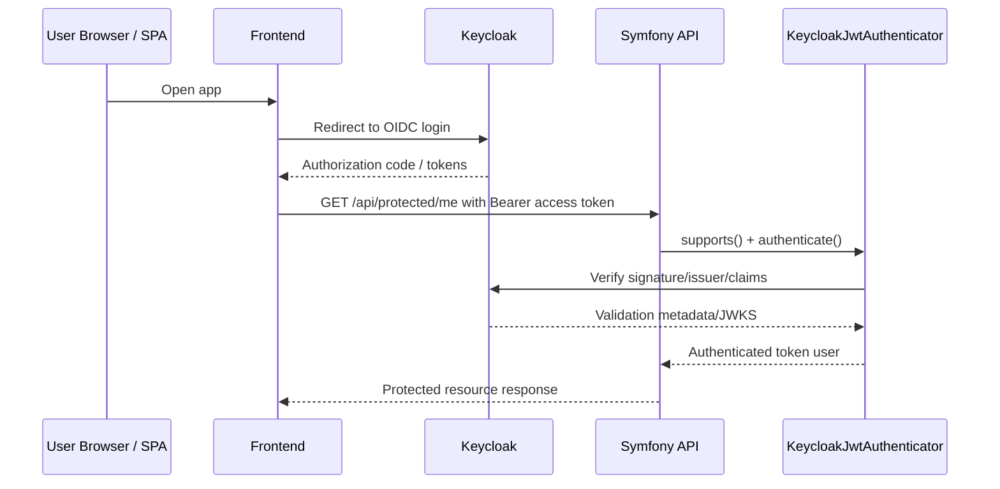

# Use Case 2: Delegating Authentication and Authorization to Keycloak

## When this is useful

Use this pattern when your frontend authenticates users directly against Keycloak (OIDC authorization code flow or other compatible OAuth2/OIDC flow), then sends JWT access tokens to your Symfony API.

Your Symfony application becomes a resource server:

- no local password checks
- JWT validation is delegated to Keycloak signing keys
- API access decisions are driven by token claims and roles

## Sequence diagram



## Minimal configuration model

1. Configure bundle connection in `config/packages/keycloak_bridge.yaml`.
2. Register security firewall authenticator (`KeycloakJwtAuthenticator`).
3. Protect API routes with `access_control`.
4. Use token roles in voters/attributes/`IsGranted` checks.

In this repository, the demo firewall is intentionally narrow and protects only the real authenticator smoke route:

```yaml
# symfony/config/packages/security.yaml
security:
  firewalls:
    dev:
      pattern: ^/(_(profiler|wdt)|css|images|js)/
      security: false

    keycloak_api:
      pattern: ^/api/protected
      stateless: true
      custom_authenticators:
        - Apacheborys\SymfonyKeycloakBridgeBundle\Security\KeycloakJwtAuthenticator

  access_control:
    - { path: ^/api/protected, roles: IS_AUTHENTICATED_FULLY }
```

## Example: broader security configuration sketch

```yaml
# config/packages/security.yaml
security:
  firewalls:
    api:
      pattern: ^/api
      stateless: true
      custom_authenticators:
        - Apacheborys\SymfonyKeycloakBridgeBundle\Security\KeycloakJwtAuthenticator

  access_control:
    - { path: ^/api/admin, roles: ROLE_ADMIN }
    - { path: ^/api, roles: IS_AUTHENTICATED_FULLY }
```

## Example: controller that reads authenticated principal

```php
<?php

declare(strict_types=1);

namespace App\Controller;

use Apacheborys\SymfonyKeycloakBridgeBundle\Security\KeycloakJwtUser;
use Symfony\Bundle\FrameworkBundle\Controller\AbstractController;
use Symfony\Component\HttpFoundation\JsonResponse;
use Symfony\Component\Routing\Attribute\Route;
use Symfony\Component\Security\Http\Attribute\IsGranted;

final class ProfileController extends AbstractController
{
    #[Route('/api/profile', methods: ['GET'])]
    #[IsGranted('IS_AUTHENTICATED_FULLY')]
    public function profile(): JsonResponse
    {
        /** @var KeycloakJwtUser $user */
        $user = $this->getUser();

        return new JsonResponse([
            'identifier' => $user->getUserIdentifier(),
            'roles' => $user->getRoles(),
        ]);
    }
}
```

## Failure mapping and safe client responses

The bundle now maps typed Keycloak HTTP exceptions to safe authenticator responses.

In this demo stack, the behavior is controlled by:

```dotenv
KEYCLOAK_BRIDGE_EXPOSE_INFRASTRUCTURE_FAILURE_STATUS=1
```

Behavior:

- `1` allows infrastructure and upstream verification failures to surface as `429`, `502`, or `503`
- `0` forces all authentication failures to return `401`
- in both modes, logs still receive safe diagnostics

Example failure response returned by the real firewall-protected route:

```json
{
  "message": "Authentication failed.",
  "reason": "keycloak_unavailable"
}
```

The API does not expose:

- raw JWT
- `Authorization` header
- `client_secret`
- `access_token`
- `refresh_token`
- password
- raw Keycloak response body

## Operational guidance

- Keep API firewall stateless.
- Verify that issuer in token matches your configured Keycloak base URL.
- Keep scopes and role mapping conventions explicit across frontend and backend.
- In this demo stack, direct debug endpoints are available:
  - `POST /api/keycloak/verify`
  - `GET /api/keycloak/me`
- The real authenticator route is:
  - `GET /api/protected/me`
- Use `/api/keycloak/verify` and `/api/keycloak/me` for direct verification debugging.
- Use `/api/protected/me` when validating real Symfony Security behavior and controlled authenticator failures.
