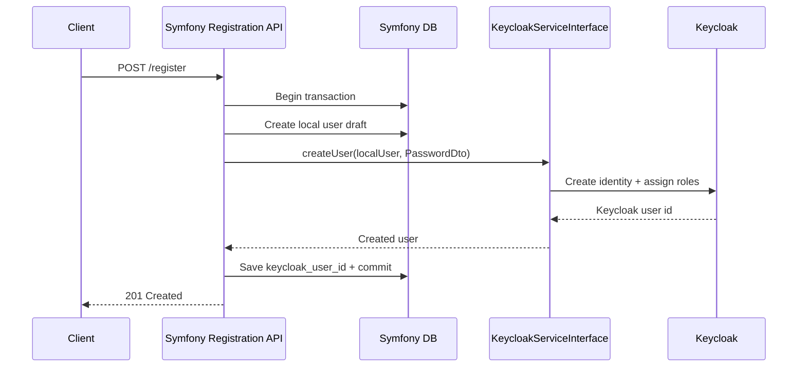

# Use Case 3: Local Registration with Keycloak as Source of Truth

## When this is useful

Use this pattern when business logic requires local user records in Symfony, but identity is still anchored in Keycloak.

Typical examples:

- local profile metadata, billing linkage, tenant metadata, or preferences in Symfony DB
- global login/identity lifecycle managed centrally in Keycloak

## Sequence diagram



## Recommended write strategy

1. Validate input in Symfony.
2. Create local user record (draft or pending state).
3. Call `KeycloakServiceInterface::createUser()`.
4. Persist external Keycloak id to local DB.
5. Commit transaction.
6. If Keycloak call fails, rollback local transaction.

## Example: registration application service

```php
<?php

declare(strict_types=1);

namespace App\Application;

use Apacheborys\KeycloakPhpClient\DTO\PasswordDto;
use Apacheborys\KeycloakPhpClient\Service\KeycloakServiceInterface;
use App\Entity\User;
use App\Keycloak\LocalUser;
use Doctrine\ORM\EntityManagerInterface;

final readonly class RegisterUserService
{
    public function __construct(
        private EntityManagerInterface $entityManager,
        private KeycloakServiceInterface $keycloakService,
    ) {
    }

    public function register(string $username, string $email, string $plainPassword): User
    {
        return $this->entityManager->wrapInTransaction(function () use ($username, $email, $plainPassword): User {
            $user = new User(username: $username, email: $email);
            $user->markPendingProvisioning();

            $this->entityManager->persist($user);
            $this->entityManager->flush();

            $keycloakUser = $this->keycloakService->createUser(
                localUser: new LocalUser(
                    username: $user->getUsername(),
                    email: $user->getEmail(),
                    firstName: $user->getFirstName() ?? '',
                    lastName: $user->getLastName() ?? '',
                    enabled: true,
                    emailVerified: false,
                    roles: ['ROLE_USER'],
                ),
                passwordDto: new PasswordDto(plainPassword: $plainPassword),
            );

            $user->markProvisionedInKeycloak($keycloakUser->getKeycloakId());
            $this->entityManager->flush();

            return $user;
        });
    }
}
```

## Synchronization considerations

- Keep `keycloak_user_id` in local DB to simplify update/delete operations.
- Persisting `keycloak_user_id` is still the recommended strategy, but with mapper-based local-id fallback the integration can continue to work even if `keycloakId` is temporarily unavailable locally.
- When local roles change, call `updateUser(oldUserVersion, newUserVersion)`.
- On user deletion, decide on hard delete vs disable, then call `deleteUser()` accordingly.
- For high traffic systems, consider outbox/event-driven provisioning with retry policies.
