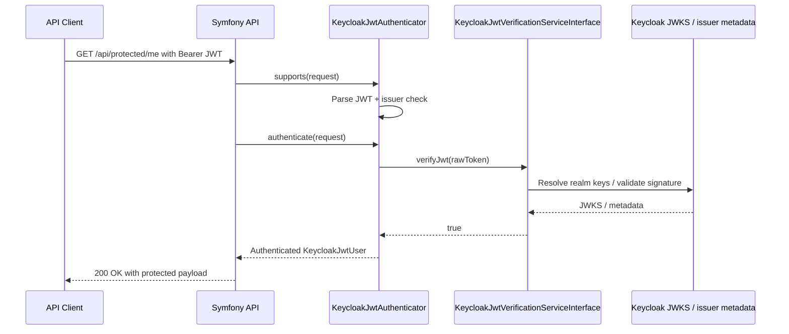

# Use Case 4: JWT Identification for Protected Symfony Resources

## When this is useful

Use this pattern when requests arrive with already issued Keycloak access tokens and your API must:

- verify JWT authenticity (signature + issuer + claims)
- identify the caller
- enforce role-based access to protected resources

## Sequence diagram



## Existing implementation in this repository

This project contains two kinds of JWT routes:

- direct debug endpoints in `KeycloakJwtDebugController`
- a real firewall-protected endpoint backed by Symfony Security and `KeycloakJwtAuthenticator`

Current routes:

- `POST /api/keycloak/verify`
  - direct verification endpoint
  - accepts `Authorization: Bearer <token>` or JSON body `{"token":"..."}`
  - calls `KeycloakJwtVerificationServiceInterface` directly
- `GET /api/keycloak/me`
  - direct debug identity endpoint
  - requires `Authorization: Bearer <token>`
  - calls `KeycloakJwtVerificationServiceInterface` directly
- `GET /api/protected/me`
  - real Symfony Security route
  - requires `Authorization: Bearer <token>`
  - goes through the configured firewall and `Apacheborys\SymfonyKeycloakBridgeBundle\Security\KeycloakJwtAuthenticator`

The direct debug endpoints are useful when you want to inspect verification behavior without the Symfony firewall.

The protected endpoint is the route to use when validating the actual authenticator integration, including safe authentication failure responses.

With the current bundle versions, this repository also treats JWT identification as a mapping concern:

- the bundle can read a callsigned local-id claim such as `external_user_id`
- `KeycloakJwtAuthenticator` can strip the callsign prefix before exposing the local user identifier

For the mapper and fallback flows built around this behavior, see [Use Case 5](./05-custom-user-mapper.md) and [Use Case 7](./07-local-id-fallback-without-persisted-keycloak-id.md).

## Failure behavior and configuration

The demo stack exposes the bundle security option:

```dotenv
KEYCLOAK_BRIDGE_EXPOSE_INFRASTRUCTURE_FAILURE_STATUS=1
```

And wires it to:

```yaml
keycloak_bridge:
  security:
    expose_infrastructure_failure_status: '%env(bool:KEYCLOAK_BRIDGE_EXPOSE_INFRASTRUCTURE_FAILURE_STATUS)%'
```

Behavior:

- `1` means infrastructure and upstream verification failures can surface as `429`, `502`, or `503`
- `0` forces all authentication failures to return `401`
- in both modes, safe diagnostics still go to logs

Example authenticator failure response from `GET /api/protected/me`:

```json
{
  "message": "Authentication failed.",
  "reason": "keycloak_unavailable"
}
```

Safety guarantees in this demo:

- raw JWT is not returned
- `Authorization` header is not returned
- `client_secret` is not returned
- `access_token` is not returned
- `refresh_token` is not returned
- password is not returned
- raw Keycloak response body is not returned

For direct debug endpoints, typed Keycloak exceptions may still produce a richer JSON payload with scrubbed metadata such as HTTP method, URI, status code, error code, and correlation id. Those diagnostics are intentionally limited and do not include secrets or raw upstream bodies.

## Example: explicit verification inside a service

```php
<?php

declare(strict_types=1);

namespace App\Security;

use Apacheborys\KeycloakPhpClient\Entity\JsonWebToken;
use Apacheborys\KeycloakPhpClient\Service\KeycloakJwtVerificationServiceInterface;
use RuntimeException;

final readonly class AccessTokenInspector
{
    public function __construct(
        private KeycloakJwtVerificationServiceInterface $jwtVerificationService,
    ) {
    }

    /**
     * @return array{subject:string, issuer:string, username:string, expiresAt:string}
     */
    public function inspect(string $rawToken): array
    {
        if (!$this->jwtVerificationService->verifyJwt($rawToken)) {
            throw new RuntimeException('JWT verification failed.');
        }

        $jwt = JsonWebToken::fromRawToken($rawToken);
        $payload = $jwt->getPayload();

        return [
            'subject' => $payload->getSub()->toString(),
            'issuer' => $payload->getIss(),
            'username' => $payload->getPreferredUsername(),
            'expiresAt' => $payload->getExp()->format(DATE_ATOM),
        ];
    }
}
```

## Test from local environment

```bash
# Use a real user access token that contains the configured local-id claim.
TOKEN='<paste-user-access-token-here>'

# Direct verification endpoint
curl -s -X POST "http://localhost:8000/api/keycloak/verify" \
  -H "Content-Type: application/json" \
  -d "{\"token\":\"${TOKEN}\"}" | jq

# Direct debug identity endpoint
curl -s "http://localhost:8000/api/keycloak/me" \
  -H "Authorization: Bearer ${TOKEN}" | jq

# Real firewall-protected endpoint
curl -s "http://localhost:8000/api/protected/me" \
  -H "Authorization: Bearer ${TOKEN}" | jq

# Missing Authorization header -> 401
curl -s "http://localhost:8000/api/protected/me" | jq

# Malformed token -> 401 with reason=malformed_token
curl -s "http://localhost:8000/api/protected/me" \
  -H "Authorization: Bearer not-a-jwt" | jq
```

The automated smoke check for this use case is part of:

```bash
docker compose exec symfony composer run keycloak:jwt-flow
```

That flow now validates:

- direct debug verification via `POST /api/keycloak/verify`
- successful access to `GET /api/protected/me`
- negative authenticator responses for missing and malformed tokens

## Production notes

- Keep clock synchronization (NTP) between nodes.
- Do not disable issuer checks.
- Keep Keycloak realm/client boundaries explicit across environments.
- Return minimal failure JSON to clients and keep detailed diagnostics in logs, not in API payloads.
