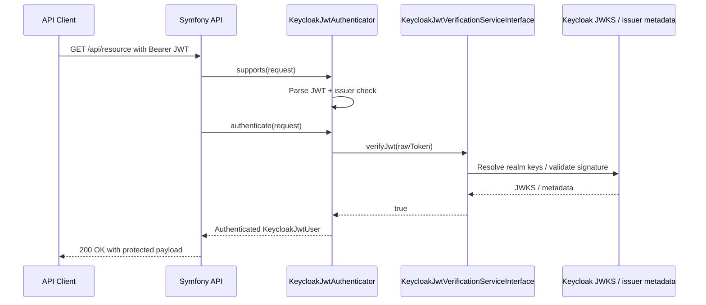

# Use Case 4: JWT Identification for Protected Symfony Resources

## When this is useful

Use this pattern when requests arrive with already issued Keycloak access tokens and your API must:

- verify JWT authenticity (signature + issuer + claims)
- identify the caller
- enforce role-based access to protected resources

## Sequence diagram



## Existing implementation in this repository

This project already contains debug endpoints in `KeycloakJwtDebugController`:

- `POST /api/keycloak/verify`
- `GET /api/keycloak/me`

These endpoints demonstrate signature validation and claim extraction using bundle services.

With the current bundle versions, this repository also treats JWT identification as a mapping concern:

- the bundle can read a callsigned local-id claim such as `external_user_id`
- `KeycloakJwtAuthenticator` can strip the callsign prefix before exposing the local user identifier

For the mapper and fallback flows built around this behavior, see [Use Case 5](./05-custom-user-mapper.md) and [Use Case 7](./07-local-id-fallback-without-persisted-keycloak-id.md).

## Example: explicit verification inside a service

```php
<?php

declare(strict_types=1);

namespace App\Security;

use Apacheborys\KeycloakPhpClient\Entity\JsonWebToken;
use Apacheborys\KeycloakPhpClient\Service\KeycloakJwtVerificationServiceInterface;
use RuntimeException;

final readonly class AccessTokenInspector
{
    public function __construct(
        private KeycloakJwtVerificationServiceInterface $jwtVerificationService,
    ) {
    }

    /**
     * @return array{subject:string, issuer:string, username:string, expiresAt:string}
     */
    public function inspect(string $rawToken): array
    {
        if (!$this->jwtVerificationService->verifyJwt($rawToken)) {
            throw new RuntimeException('JWT verification failed.');
        }

        $jwt = JsonWebToken::fromRawToken($rawToken);
        $payload = $jwt->getPayload();

        return [
            'subject' => $payload->getSub()->toString(),
            'issuer' => $payload->getIss(),
            'username' => $payload->getPreferredUsername(),
            'expiresAt' => $payload->getExp()->format(DATE_ATOM),
        ];
    }
}
```

## Test from local environment

```bash
# 1) obtain token
TOKEN=$(curl -s -X POST "http://localhost:8080/realms/master/protocol/openid-connect/token" \
  -H "Content-Type: application/x-www-form-urlencoded" \
  -d "grant_type=client_credentials" \
  -d "client_id=${KEYCLOAK_BRIDGE_CLIENT_ID}" \
  -d "client_secret=${KEYCLOAK_BRIDGE_CLIENT_SECRET}" | jq -r '.access_token')

# 2) verify via Symfony endpoint
curl -s -X POST "http://localhost:8000/api/keycloak/verify" \
  -H "Authorization: Bearer ${TOKEN}"
```

## Production notes

- Keep clock synchronization (NTP) between nodes.
- Do not disable issuer checks.
- Keep Keycloak realm/client boundaries explicit across environments.
