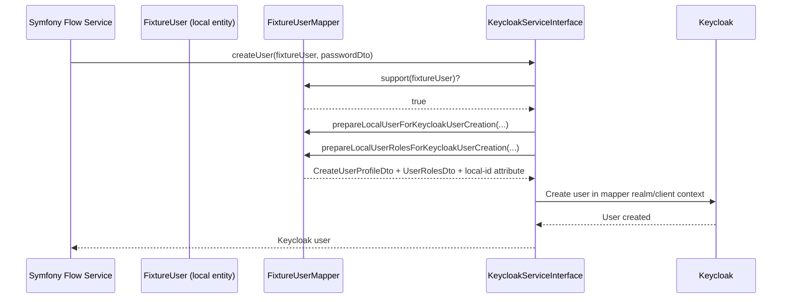

# Use Case 5: Custom User Mapper for Advanced Domain Mapping

## When this is useful

Use a custom mapper when the default mapping is not enough, for example:

- you route different user entity classes to different realms
- you use different clients/scopes for specific user domains
- you need role projection (for example, add prefix/suffix before sending roles to Keycloak)

In this repository, `FixtureUserMapper` demonstrates this pattern.

For current bundle/client versions this scenario also covers two additional concerns:

- mapper-supplied local user identifier attribute for fallback lookup
- callsign-aware JWT identification (`external_user_id` -> stripped local id)

## Sequence diagram



## Configuration example

```yaml
# config/packages/keycloak_bridge.yaml
keycloak_bridge:
  callsign: '%env(KEYCLOAK_BRIDGE_CALLSIGN)%'
  user_entities:
    'App\\Keycloak\\LocalUser':
      realm: '%env(KEYCLOAK_BRIDGE_USER_REALM)%'
      role:
        allow_creation: true

    'App\\Keycloak\\FixtureUser':
      realm: '%env(KEYCLOAK_BRIDGE_MAPPER_REALM)%'
      mapper: 'App\\Keycloak\\Mapper\\FixtureUserMapper'
```

## Example: mapper skeleton

```php
<?php

declare(strict_types=1);

namespace App\Keycloak\Mapper;

use Apacheborys\KeycloakPhpClient\DTO\Request\Oidc\OidcTokenRequestDto;
use Apacheborys\KeycloakPhpClient\DTO\Request\Role\UserRolesDto;
use Apacheborys\KeycloakPhpClient\DTO\Request\User\AttributeValueDto;
use Apacheborys\KeycloakPhpClient\DTO\Request\User\CreateUserProfileDto;
use Apacheborys\KeycloakPhpClient\DTO\Request\User\DeleteUserDto;
use Apacheborys\KeycloakPhpClient\DTO\Request\User\UpdateUserDto;
use Apacheborys\KeycloakPhpClient\DTO\Request\User\UpdateUserProfileDto;
use Apacheborys\KeycloakPhpClient\Entity\KeycloakUserInterface;
use Apacheborys\KeycloakPhpClient\Mapper\LocalKeycloakUserBridgeMapperInterface;
use App\Keycloak\FixtureUser;
use Ramsey\Uuid\Uuid;

final readonly class FixtureUserMapper implements LocalKeycloakUserBridgeMapperInterface
{
    public function getRealm(KeycloakUserInterface $localUser): string
    {
        return 'master';
    }

    public function support(KeycloakUserInterface $localUser): bool
    {
        return $localUser instanceof FixtureUser;
    }

    public function getLocalUserIdAttribute(KeycloakUserInterface $localUser): AttributeValueDto
    {
        return new AttributeValueDto(
            attributeName: self::DEFAULT_LOCAL_USER_ID_ATTRIBUTE_NAME,
            attributeValue: $localUser->getId(),
        );
    }

    public function prepareLocalUserForKeycloakUserCreation(KeycloakUserInterface $localUser): CreateUserProfileDto
    {
        return new CreateUserProfileDto(
            username: $localUser->getUsername(),
            email: $localUser->getEmail(),
            emailVerified: $localUser->isEmailVerified(),
            enabled: $localUser->isEnabled(),
            firstName: $localUser->getFirstName(),
            lastName: $localUser->getLastName(),
            realm: $this->getRealm($localUser),
            attributes: [$this->getLocalUserIdAttribute($localUser)],
        );
    }

    public function prepareLocalUserRolesForKeycloakUserCreation(
        KeycloakUserInterface $localUser,
        array $availableRoles,
    ): UserRolesDto {
        // return projected roles resolved against $availableRoles
    }

    public function prepareLocalUserForKeycloakLoginUser(KeycloakUserInterface $localUser, string $plainPassword): OidcTokenRequestDto
    {
        return new OidcTokenRequestDto(
            realm: $this->getRealm($localUser),
            clientId: 'mapper-client',
            clientSecret: 'mapper-secret',
            username: $localUser->getUsername(),
            password: $plainPassword,
        );
    }

    public function prepareLocalUserForKeycloakUserDeletion(KeycloakUserInterface $localUser): DeleteUserDto
    {
        return new DeleteUserDto(
            realm: $this->getRealm($localUser),
            userId: $localUser->getKeycloakId() !== null ? Uuid::fromString($localUser->getKeycloakId()) : null,
            localUserId: $localUser->getId(),
        );
    }

    public function prepareLocalUserDiffForKeycloakUserUpdate(
        KeycloakUserInterface $oldUserVersion,
        KeycloakUserInterface $newUserVersion,
    ): UpdateUserDto {
        return new UpdateUserDto(
            realm: $this->getRealm($newUserVersion),
            profile: new UpdateUserProfileDto(
                username: $newUserVersion->getUsername(),
                email: $newUserVersion->getEmail(),
                emailVerified: $newUserVersion->isEmailVerified(),
                enabled: $newUserVersion->isEnabled(),
                firstName: $newUserVersion->getFirstName(),
                lastName: $newUserVersion->getLastName(),
                attributes: [$this->getLocalUserIdAttribute($newUserVersion)],
            ),
            userId: $newUserVersion->getKeycloakId() !== null ? Uuid::fromString($newUserVersion->getKeycloakId()) : null,
            localUserId: $newUserVersion->getId(),
        );
    }

    public function prepareLocalUserRolesForKeycloakUserUpdate(
        KeycloakUserInterface $oldUserVersion,
        KeycloakUserInterface $newUserVersion,
        array $availableRoles,
    ): UserRolesDto {
        // return projected roles resolved against $availableRoles
    }
}
```

## How to validate in this demo

```bash
docker compose exec symfony composer run keycloak:mapper-flow
```

Expected checks performed by the command:

- user created with custom entity mapper
- JWT issuer belongs to mapper realm
- JWT `azp` matches mapper client id
- projected mapper roles are present in JWT
- local-id attribute is available for fallback lookup
- user and fixture rows are cleaned up after flow

For the local-id fallback scenario built on top of the same mapper conventions, see [Use Case 7](./07-local-id-fallback-without-persisted-keycloak-id.md).
