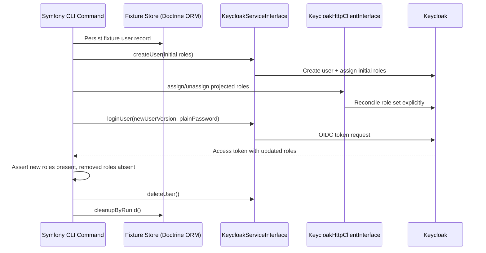

# Use Case 6: Role Lifecycle Automation and JWT Role Verification

## Why this scenario matters

Beyond login, most teams need automated role lifecycle operations:

- create users with initial roles
- update roles when permissions change
- verify that resulting JWT claims reflect the new role set
- clean up temporary users used in integration checks

This repository includes exactly this flow in `keycloak:role-management:flow`.

## Sequence diagram



## API shape used by the flow

```php
$created = $keycloakService->createUser($localUser, new PasswordDto(plainPassword: $password));

$login = $keycloakService->loginUser($newUser, $password);

$keycloakService->deleteUser($userWithIdForCleanup);
```

## Repository note for current library versions

In this repository the role-management flow intentionally uses the public `KeycloakHttpClientInterface` for explicit role assign/unassign after user creation.

Why:

- the scenario being validated is not only role assignment, but also reliable removal of previously assigned roles
- for current library versions, this explicit reconciliation path is the most predictable way to verify that JWT role projection changes as expected

This keeps the demo honest: it documents the current working integration shape instead of pretending that everything is already covered by one higher-level convenience call.

## Example: role update pattern

```php
<?php

declare(strict_types=1);

namespace App\Application;

use Apacheborys\KeycloakPhpClient\Service\KeycloakServiceInterface;
use App\Keycloak\LocalUser;
use App\Keycloak\KeycloakUserCloneFactory;
use RuntimeException;

final readonly class UserRoleUpdater
{
    public function __construct(
        private KeycloakServiceInterface $keycloakService,
        private KeycloakUserCloneFactory $userCloneFactory,
    ) {
    }

    /**
     * @param list<string> $currentRoles
     * @param list<string> $newRoles
     */
    public function updateRoles(LocalUser $baseUser, string $plainPassword, array $currentRoles, array $newRoles): void
    {
        $currentUser = $this->keycloakService->findUser($baseUser);
        $keycloakId = $currentUser->getKeycloakId();
        if ($keycloakId === null) {
            throw new RuntimeException('Expected persisted Keycloak id before reconciling roles.');
        }

        $newUserVersion = $this->userCloneFactory->withKeycloakId(
            localUser: $baseUser,
            keycloakId: $keycloakId,
            roles: $newRoles,
        );

        // Reconcile role assign/unassign through the public Keycloak role API.
        // In this repository that logic is kept in a dedicated flow service.
        $this->synchronizeRoles($keycloakId, $currentRoles, $newRoles);

        // Afterwards, verify JWT projection against the new local role set.
        $this->keycloakService->loginUser($newUserVersion, $plainPassword);
    }
}
```

## Run and verify locally

```bash
docker compose exec symfony composer run keycloak:role-flow
```

What this command verifies end-to-end:

- initial roles are assigned
- updated roles are visible in JWT
- removed roles no longer appear in JWT
- test user is deleted from Keycloak
- fixture records are deleted from Symfony DB
