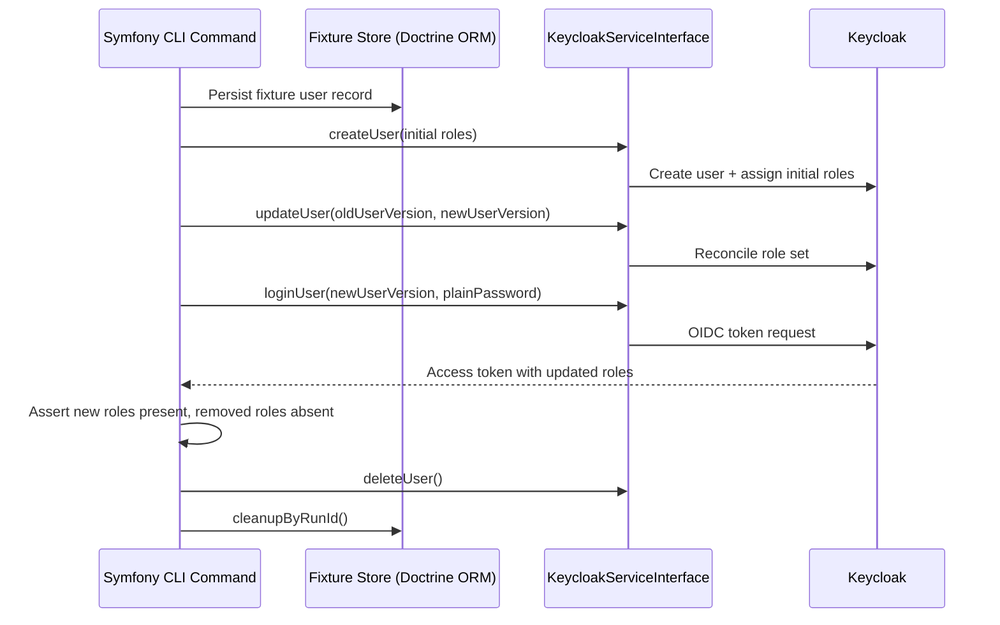

# Use Case 6: Role Lifecycle Automation via `KeycloakServiceInterface`

## Why this scenario matters

Beyond login, most teams need automated role lifecycle operations:

- create users with initial roles
- update roles when permissions change
- verify that resulting JWT claims reflect the new role set
- clean up temporary users used in integration checks

This repository includes exactly this flow in `keycloak:role-management:flow`.

## Sequence diagram



## API shape used by the flow

```php
$created = $keycloakService->createUser($localUser, new PasswordDto(plainPassword: $password));

$updated = $keycloakService->updateUser(
    oldUserVersion: $oldUser,
    newUserVersion: $newUser,
);

$login = $keycloakService->loginUser($newUser, $password);

$keycloakService->deleteUser($userWithIdForCleanup);
```

## Example: role update pattern

```php
<?php

declare(strict_types=1);

namespace App\Application;

use Apacheborys\KeycloakPhpClient\Service\KeycloakServiceInterface;
use App\Keycloak\LocalUser;

final readonly class UserRoleUpdater
{
    public function __construct(private KeycloakServiceInterface $keycloakService)
    {
    }

    /**
     * @param list<string> $currentRoles
     * @param list<string> $newRoles
     */
    public function updateRoles(LocalUser $baseUser, array $currentRoles, array $newRoles): void
    {
        $oldVersion = new LocalUser(
            username: $baseUser->getUsername(),
            email: $baseUser->getEmail(),
            firstName: $baseUser->getFirstName(),
            lastName: $baseUser->getLastName(),
            enabled: $baseUser->isEnabled(),
            emailVerified: $baseUser->isEmailVerified(),
            roles: $currentRoles,
            id: $baseUser->getId(),
        );

        $newVersion = new LocalUser(
            username: $baseUser->getUsername(),
            email: $baseUser->getEmail(),
            firstName: $baseUser->getFirstName(),
            lastName: $baseUser->getLastName(),
            enabled: $baseUser->isEnabled(),
            emailVerified: $baseUser->isEmailVerified(),
            roles: $newRoles,
            id: $baseUser->getId(),
        );

        $this->keycloakService->updateUser($oldVersion, $newVersion);
    }
}
```

## Run and verify locally

```bash
docker compose exec symfony composer run keycloak:role-flow
```

What this command verifies end-to-end:

- initial roles are assigned
- updated roles are visible in JWT
- removed roles no longer appear in JWT
- test user is deleted from Keycloak
- fixture records are deleted from Symfony DB
