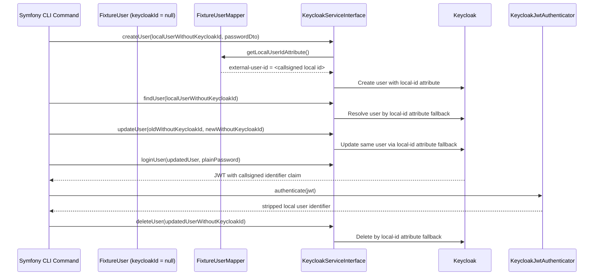

# Use Case 7: Operating Without Persisted Keycloak Id

## Why this scenario matters

Some systems cannot reliably persist the external Keycloak UUID on every local user record:

- legacy schemas may not yet have a dedicated `keycloak_user_id` column
- some write paths may be asynchronous or eventually consistent
- fixture/demo entities may deliberately avoid persisting external identity state

Current library versions support an important fallback: operations can still continue through a stable local identifier when the mapper exposes it as a Keycloak attribute and the bundle is configured with a `callsign`.

## Sequence diagram



## Current repository assumptions

- `LocalUser::getId()` / `FixtureUser::getId()` is the stable local identifier.
- `getKeycloakId()` is the persisted external Keycloak UUID and may be `null`.
- `keycloak_bridge.callsign` is configured and stable.
- The custom mapper publishes the local identifier as a Keycloak attribute.
- JWT processing can recover the raw local id from the callsigned claim.

In this repository the relevant values are:

- Keycloak attribute: `external-user-id`
- JWT claim: `external_user_id`

## What the demo flow validates

`keycloak:local-id-fallback:flow` verifies all of the following with `keycloakId = null` on both initial and updated local entities:

- user creation
- fallback `findUser()`
- fallback `updateUser()`
- callsigned local-id attribute presence in Keycloak
- callsigned JWT identifier claim in both access and refreshed tokens
- correct stripping of the callsign prefix by `KeycloakJwtAuthenticator`
- fallback `deleteUser()`
- post-delete absence in Keycloak search results

## Run locally

```bash
docker compose exec symfony composer run keycloak:local-id-fallback-flow
```

## Design guidance

- Persisting `keycloak_user_id` is still recommended when your domain model allows it.
- The fallback path is valuable as resilience, migration support, and a proof that local-id-based mapping is configured correctly.
- Keep the local identifier immutable. If it changes, fallback lookup semantics become unsafe.
- Treat the callsign as part of the public integration contract between your local model, Keycloak attributes, and JWT claims.
